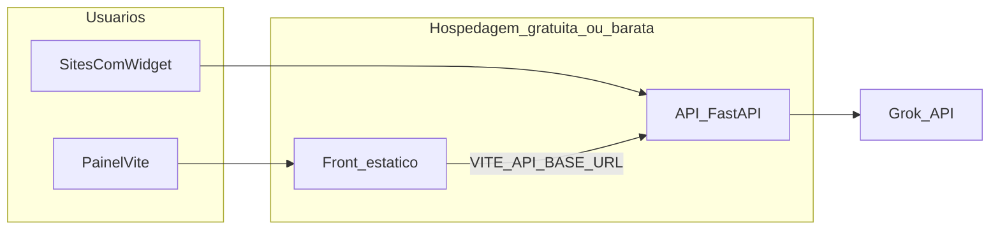

# Hospedagem gratuita ou barata para testes com usuários reais

Este guia complementa [`DEPLOY_AWS.md`](DEPLOY_AWS.md). Ele descreve alternativas para expor **bot_ia_sites** (FastAPI em Docker, porta **8000**) e o painel **front-end-bot_ia_sites** (build estático Vite) com **custo zero ou próximo**, adequadas a **experimentos com usuários reais**.

Políticas de preços e limites **mudam com frequência**. Sempre confira as páginas oficiais de cada provedor antes de decidir.

---

## Introdução: o que “grátis” pode significar

| Tipo | Exemplo | Expectativa |
|------|---------|-------------|
| **Grátis contínuo com limites** | Cotas mensais de CPU/requisições (cloud serverless), VMs “Always Free” | Pode ser suficiente para dezenas ou poucos milhares de requisições/mês, conforme o produto |
| **Scale-to-zero** | Cloud Run, alguns planos free com spin-down | Primeira requisição após ociosidade pode demorar (**cold start**) |
| **Créditos / trial** | Railway, GCP trial | Bom para semanas de teste; depois cobrança ou encerramento |
| **Cartão obrigatório** | Vários clouds | Não significa cobrança imediata, mas exige atenção ao uso |

Para este projeto, respostas em **`POST /chat`** dependem da **Grok** e podem levar **vários segundos**. Escolha plataformas com **timeout de requisição** e **memória** compatíveis com isso.

---

## Critérios para esta stack

- **HTTPS** público estável (widget e navegadores esperam URL segura em produção).
- **Container Docker** ou runtime Python com controle de porta (o `Dockerfile` usa **8000**).
- **Variáveis de ambiente** no serviço: pelo menos `ADMIN_TOKEN`, `GROK_API_KEY`, `BASE_URL` (e opcionais do `.env.example`).
- **`GET /widget.js`** e **`POST /chat`** acessíveis sem o header admin; **`POST /config`** continua protegido (`X-ADMIN-TOKEN`).
- **CORS** já amplo na API (`allow_origins=["*"]`); sites de terceiros podem embutir o script sem mudança extra.
- **Painel:** hospedar `dist/` em provedor **estático gratuito** e definir `VITE_API_BASE_URL` **no build** com a URL HTTPS da API.



---

## Opções resumidas

| Opção | Docker / API | HTTPS | Observações para `/chat` longo |
|--------|----------------|-------|--------------------------------|
| **Google Cloud Run** | Imagem de container | Sim (URL gerenciada) | Ajustar **timeout máximo** da revisão (até limite da plataforma); ver nota de **porta** abaixo |
| **Fly.io** | Dockerfile nativo | Sim (`*.fly.dev` ou custom) | Planos gratuitos mudam; verificar limites atuais |
| **Render** | Web Service + Dockerfile | Sim | Plano free costuma ter **spin-down** e limites de CPU/timeout |
| **Railway** | Container / Nix | Sim | Forte para MVP; costuma ser **crédito/trial**, não “grátis para sempre” |
| **Oracle Cloud Always Free** | VM Ampere + `docker run` | Você configura (ex.: Caddy) | **Sem cobrança** no tier Always Free, mas mais trabalho de VPS |
| **Painel estático** | N/A | Sim | **Cloudflare Pages**, **Netlify** ou **GitHub Pages** — grátis para sites estáticos |

Links úteis para conferir condições atuais (sem garantir que permaneçam iguais):

- [Google Cloud Run pricing](https://cloud.google.com/run/pricing)
- [Fly.io pricing](https://fly.io/docs/about/pricing/)
- [Render pricing](https://render.com/pricing)
- [Railway pricing](https://railway.app/pricing)
- [Oracle Cloud Free Tier](https://www.oracle.com/cloud/free/)

---

## Recomendação pragmática

1. **Primeira escolha para menos atrito + HTTPS + container:** **Google Cloud Run** — encaixa bem no `Dockerfile`, escala a zero e costuma ter cotas gratuitas relevantes para testes (validar na calculadora e na documentação vigente).
2. **Se você já usa outro provedor:** **Fly.io** ou **Render** são alternativas comuns para o mesmo tipo de API em container.
3. **Oracle Always Free** vale a pena se você quer uma VM **sempre ligada** sem custo recorrente no tier e aceita configurar firewall, atualizações e TLS manualmente (ou com Caddy).

Para o **painel**, publique o build em **Cloudflare Pages** ou **Netlify** com variável de ambiente `VITE_API_BASE_URL` apontando para a URL da API — independentemente de onde a API rode.

---

## Cloud Run e porta do container (`8000` vs `PORT`)

O [`Dockerfile`](../Dockerfile) expõe **8000** e o `CMD` fixa `--port 8000`.

No console do **Cloud Run**, ao criar o serviço, defina a **porta do contêiner** como **8000** para coincidir com o uvicorn. (O Cloud Run também define a variável `PORT`; se no futuro você padronizar `CMD` para ler `$PORT`, alinhe o Dockerfile — opcional.)

Aumente o **timeout da requisição** na revisão do serviço para acomodar respostas lentas do modelo.

---

## Checklist detalhado: Google Cloud Run (produção ou pré-produção)

Use este fluxo para subir **bot_ia_sites** com o [`Dockerfile`](../Dockerfile) (uvicorn na porta **8000**). Ajuste `PROJECT_ID`, `REGION` e nomes de repositório/serviço aos seus valores.

**Região (`REGION`):** escolha uma região próxima aos usuários (ex.: `southamerica-east1` — São Paulo). Artifact Registry e o serviço Cloud Run devem usar a **mesma** região para simplificar.

Documentação oficial útil:

- [Implantar contêiner pré-construído](https://cloud.google.com/run/docs/deploying#container)
- [Timeouts e cotas](https://cloud.google.com/run/docs/configuring/request-timeout)
- [Variáveis e secrets](https://cloud.google.com/run/docs/configuring/services/secrets)

---

### 1. Conta, faturamento e ferramentas

1. [ ] Criar projeto no [Google Cloud Console](https://console.cloud.google.com/) ou escolher um existente; anotar o **ID do projeto** (`PROJECT_ID`).
2. [ ] **Faturamento** ativado no projeto (Cloud Run em produção exige conta de faturamento; ainda assim pode haver uso dentro do free tier — veja [preços](https://cloud.google.com/run/pricing)).
3. [ ] Instalar [Google Cloud SDK](https://cloud.google.com/sdk/docs/install) e autenticar:

   ```bash
   gcloud auth login
   gcloud config set project PROJECT_ID
   ```

---

### 2. Habilitar APIs

Execute uma vez (ou habilite pelo console em “APIs e serviços”):

```bash
gcloud services enable run.googleapis.com artifactregistry.googleapis.com cloudbuild.googleapis.com
```

(Opcional) **Secret Manager** para não colocar chaves em texto na revisão:

```bash
gcloud services enable secretmanager.googleapis.com
```

---

### 3. Repositório no Artifact Registry

1. [ ] Criar repositório Docker (ex.: `bot-ia-sites`):

   ```bash
   gcloud artifacts repositories create bot-ia-sites \
     --repository-format=docker \
     --location=REGION \
     --description="Imagens da API bot_ia_sites"
   ```

2. [ ] Configurar o Docker para autenticar nesse host (uma vez por máquina):

   ```bash
   gcloud auth configure-docker REGION-docker.pkg.dev
   ```

---

### 4. Build e push da imagem

Na pasta raiz do repositório **bot_ia_sites** (onde está o `Dockerfile`):

```bash
docker build -t bot-ia-sites-api .
docker tag bot-ia-sites-api:latest REGION-docker.pkg.dev/PROJECT_ID/bot-ia-sites/bot-ia-sites-api:latest
docker push REGION-docker.pkg.dev/PROJECT_ID/bot-ia-sites/bot-ia-sites-api:latest
```

**Alternativa:** build na nuvem com **Cloud Build** a partir do mesmo `Dockerfile` (útil em CI); o resultado continua sendo push para Artifact Registry.

---

### 5. Criar ou atualizar o serviço Cloud Run

A API precisa ser **pública** (sem login Google) para o widget em sites de terceiros e para `POST /chat` / `GET /widget.js`.

**Via linha de comando (primeiro deploy ou atualização):**

```bash
gcloud run deploy bot-ia-sites-api \
  --image REGION-docker.pkg.dev/PROJECT_ID/bot-ia-sites/bot-ia-sites-api:latest \
  --region REGION \
  --platform managed \
  --allow-unauthenticated \
  --port 8000 \
  --memory 512Mi \
  --cpu 1 \
  --timeout 300 \
  --max-instances 10 \
  --set-env-vars "ADMIN_TOKEN=SEU_ADMIN_TOKEN,GROK_API_KEY=SUA_CHAVE,BASE_URL=https://seu-site-de-contexto/"
```

Ajuste:

| Flag / campo | Orientação |
|--------------|------------|
| `--port 8000` | **Obrigatório** alinhar ao `Dockerfile` (uvicorn em 8000). |
| `--timeout` | Tempo máximo por requisição (segundos). Para Grok com respostas longas, use **300** ou mais; o máximo suportado pelo produto pode mudar — veja a doc atual (até **3600** s em configurações comuns). |
| `--memory` | Se o carregamento do site (RAG) for pesado, suba para **1Gi** ou **2Gi** e monitore. |
| `--allow-unauthenticated` | Necessário para tráfego público HTTP ao serviço (o **seu** `POST /config` continua protegido pelo header `X-ADMIN-TOKEN`). |
| `--max-instances` | Limite de custo/concorrência; ajuste à demanda. |

**Variáveis opcionais** (mesmo padrão do `.env.example`): `MODEL`, `MAX_CONTEXT_CHARS`, `MAX_RESPONSE_TOKENS`, `MAX_HISTORY_MESSAGES`. Separe pares com vírgula em `--set-env-vars` ou use várias flags `--set-env-vars` / arquivo YAML em pipelines. Se algum valor contiver **vírgulas**, prefira definir pelo **console** ou **Secret Manager** para não quebrar o parser da CLI.

**Secrets (recomendado em produção):** crie segredos no **Secret Manager** (`ADMIN_TOKEN`, `GROK_API_KEY`) e monte como variáveis de ambiente na revisão do Cloud Run (console: *Editar e implantar novo revisão* → *Variáveis e secrets* → referência ao secret). Assim os valores não ficam visíveis em linhas de comando nem no histórico do shell.

**Via console:** *Cloud Run* → *Criar serviço* → implantar a imagem do Artifact Registry → em *Conectividade* permitir acesso não autenticado → em *Contêiner* definir **porta do contêiner 8000** → *Variáveis de ambiente* e *Secrets* → *Solicitação* aumentar **timeout da solicitação** e memória/CPU.

---

### 6. Domínio customizado (opcional)

1. [ ] Em *Cloud Run* → seu serviço → *Gerenciar domínios personalizados*, siga o assistente (registro **CNAME** ou mapeamento no provedor DNS).
2. [ ] Certificado TLS é provisionado pelo Google para o hostname do Cloud Run ou o domínio mapeado.
3. [ ] Atualize o painel: novo build com `VITE_API_BASE_URL=https://api.seudominio.com` (URL final do widget e do fetch).

---

### 7. Produção: cold start e disponibilidade

- Com **mínimo de instâncias = 0** (padrão), a primeira requisição após ociosidade pode ter **latência maior** (cold start). Para reduzir isso em produção, configure **instâncias mínimas** maiores que zero (custo contínuo; avalie no console).
- Monitore **Logs** (*Logging*) e métricas de latência/erros 5xx.

---

### 8. Próximos deploys (nova versão)

Sempre que alterar o código:

1. [ ] `docker build` + `docker push` com a mesma tag (`:latest`) ou uma tag versionada (`:v1.0.1`).
2. [ ] `gcloud run deploy ...` com a **nova** referência de imagem (recomenda-se tag imutável por release para rastreio).

---

### 9. Pós-deploy e front

1. [ ] Anotar a URL HTTPS exibida pelo Cloud Run (ou o domínio customizado).
2. [ ] Rodar os **smoke tests** da seção **Checklist genérico (qualquer provedor de API)** mais abaixo (`/docs`, `/widget.js`, `/config`, `/chat`).
3. [ ] Build do **front-end-bot_ia_sites** com `VITE_API_BASE_URL` apontando para essa URL e publicar o `dist/` (Pages/Netlify etc.).

Referência genérica de contêiner: [Implantar no Cloud Run a partir de uma imagem de contêiner](https://cloud.google.com/run/docs/deploying#container).

---

## Checklist genérico (qualquer provedor de API)

- [ ] Imagem construída a partir da raiz de **bot_ia_sites** (`docker build`) ou equivalente no CI do provedor.
- [ ] Serviço escuta na mesma **porta** configurada no provedor (ex.: **8000** neste repositório).
- [ ] Variáveis de ambiente configuradas; **nunca** commitar `.env` com secrets.
- [ ] Smoke tests:
  - [ ] `GET /docs` abre o Swagger.
  - [ ] `GET /widget.js` retorna 200.
  - [ ] `POST /config` sem `X-ADMIN-TOKEN` → **401**.
  - [ ] `POST /config` com token correto → **200**.
  - [ ] `POST /chat` sem token admin → resposta do bot.
- [ ] Painel: rebuild com `VITE_API_BASE_URL` igual à URL HTTPS da API em produção de teste.
- [ ] Incorporar o snippet `<script src="https://<sua-api>/widget.js"></script>` em uma página de teste e validar com um usuário real.

Para mais detalhes de validação em ambiente cloud próximo ao da AWS, veja também a seção de validação em [`DEPLOY_AWS.md`](DEPLOY_AWS.md).

---

## Painel estático (grátis)

1. [ ] `npm ci && npm run build` em **front-end-bot_ia_sites** com `VITE_API_BASE_URL` definida.
2. [ ] Enviar `dist/` para **Cloudflare Pages**, **Netlify** ou **GitHub Pages**.
3. [ ] Confirmar que o formulário chama a API na URL correta e que erros **401** aparecem de forma clara quando o token admin estiver errado.

**Segurança:** não use `VITE_ADMIN_TOKEN` em repositórios ou builds públicos se o token for sensível.

---

## Quando migrar para AWS ou outro ambiente pago

Quando precisar de SLA, VPC fixa, limites de custo previsíveis corporativos ou integração com o restante da sua infraestrutura na AWS, use o checklist em [`DEPLOY_AWS.md`](DEPLOY_AWS.md) (ECS Modo Expresso, ECR, etc.).

---

## Referência no repositório

- API: [`Dockerfile`](../Dockerfile), `uvicorn app.views.api:app`.
- Variáveis: `.env.example` em **bot_ia_sites** e **front-end-bot_ia_sites**.
